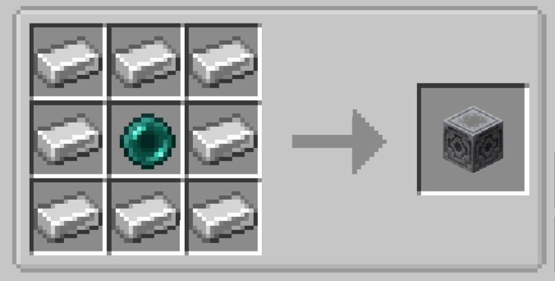

# Simple Chunk Loader

`Simple Chunk Loader` is a server-side Fabric mod that adds a simple chunk loader block for keeping selected areas loaded.



This mod was developed only for a small server to play with friends. It is not intended or tested for large public servers.

## Compatibility

- Minecraft `1.21.11`
- Fabric Loader `0.18.4+`
- Java `21`

## Development

Build the project with:

```bash
./gradlew build
```

## License

This project is licensed under `CC0-1.0`. See `LICENSE` for the full text.
